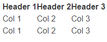

-   [Download](#article1)
-   [Link2](#article2)
-   [Link3](#article3)
-   [Link4](#article4)
-   [Link5](#article5)


<style>
.coral {
  color: inherit;
  background: inherit;
}
.coral.bordered tr {
  border: 1px solid #f66079;
}
.coral.columns td,
.coral th {
  border-left: 1px solid #f66079;
  border-right: 1px solid #f66079;
}
.coral thead {
  background: #f66079;
  color: white;
}
.coral tr {
  border-bottom: 1px solid #f66079;
}
.coral.striped.bordered tr {
  border: 1px solid #f66079;
}
.coral.striped th {
  color: #f7f7f7;
}
.coral.striped tr {
  border: none;
  color: #f66079;
}
.coral.striped tr:nth-child(even) {
  background: #ff8196;
  color: white;
}
    .ct-scroll {
  width: 100%;
  height: 100%;
  overflow: auto;
  white-space: nowrap;
}

.commatable thead th {
  padding: 0.3rem 0.7rem 0.3rem 0.7rem;
}
.commatable td {
  padding: 0.7rem;
}
.commatable tr {
  border-bottom: 1px solid #323330;
}

    </style>
Docs
----

#### Downloading commatables.js {#article1}

##### Method 1: CDN
html


                        
        <!--CSS Packages--> 
        <link rel="stylesheet" href="https://cdn.jsdelivr.net/gh/sammarth-k/commatables.js/1.0.0/commastyles.min.css">
        
        <!--JavaScript Packages-->
        <script src="https://cdn.jsdelivr.net/gh/sammarth-k/commatables.js/1.0.0/commatables.min.js"></script> 
        <!--You only need to add this if you want to use csv/txt files-->           
        <script src="https://cdn.jsdelivr.net/gh/jquery/jquery@3.2.1/dist/jquery.min.js"></script>     
      

##### Method 2: Download Package via GitHub

You can visit [this
page](https://github.com/sammarth-k/commatables.js/releases) to download
a `.zip` or `tar.gz` file with the source code.

* * * * *

#### Usage {#article2}

To use commatables.js, you need to link the JavaScript and CSS file in
your  document. To use the `csv2tab` feature you must add JQuery
right below the `commatables.js` file. Make sure you do this step as it
is shown here to prevent any error in generating tables.


                            
        <script src="path/commatables.js"></script>
        <script src="path/jquery.js"></script>
                              

Make sure you add this at the end of the document, before the `</body>`

At the beginning of your document, you want to add your stylesheet, as
so:


                            
        <head>
        <link rel="stylesheet" href="path/commastyles.css">
        </head>
                              

Next, inside the body you have to create a `<div>` with the class
`commatable` (this class is essential for the script to find all your
CommaTables).


``` {.}                  
    <div class="commatable"></div>                    
```

After that, you want to create your first table. To do so, you can use
**",", ";" and "|"** as your delimiters for columns and go to the next
line for a new row. Don't worry, whitespace on either ends of your rows
or cells won't affect the output since the script removes all whitespace
with the `trim()`.\
 Your CommaTable should be created as follows:


``` {.} html
                        
    <div class="commatable">
        Header 1, Header 2, Header 3
        Col 1, Col 2, Col 3
        Col 1, Col 2, Col 3
    </div>
                          
```

The output will be as shown:


Yikes, that doesn't look too good. Don't worry, we have a CSS library
dedicated to commatables.js. In the next section, you will see how to
create beatiful tables with responsive design.

#### Using the CSS {#article3}

In this section, we will look at how to use the CSS library to make your
CommaTables look amazing. All the examples used have been made using
commatables.js and the commastyles CSS library.

Let's start by looking at the default style we get when we use the
library:


``` {.}                 
    <div class="commatable">
        Header 1, Header 2, Header 3
        Col 1, Col 2, Col 3
        Col 1, Col 2, Col 3
    </div>                     
```

Output:



<br>
<br>

Right away you see that our table now looks much cleaner. In fact, it's
also responsive. In the following example, you can see how the table
adapts to the given constraints.

<div class="commatable"><div class="ct-scroll"><table><thead><tr><th>Header 1</th><th>Header 2</th><th>Header 3</th><th>Header 4</th><th>Header 5</th><th>Header 6</th><th>Header 7</th><th>Header 8</th><th>Header 9</th><th>Header 10</th></tr></thead><tbody><tr><td>Col 1</td><td>Col 2</td><td>Col 3</td><td>Col 4</td><td>Col 5</td><td>Col 6</td><td>Col 7</td><td>Col 8</td><td>Col 9</td><td>Col 10</td></tr></tbody></table></div></div>

You can try changing your window size to see how the table responds. You
also don't worry about your text overflowing since whitespace is set to
`nowrap` in the CSS.

Let's now look at some of the different styles of tables we can create
with the CSS Library. For these examples, we will be using the `coral`
theme.

##### Adding Color to CommaTables

To add colors and themes to your CommaTable, you need to specify the
theme name as a class of the `div` your CommaTable is being generated
in.


``` {.}         
    <div class="commatable coral">
        Header 1, Header 2, Header 3
        Col 1, Col 2, Col 3
        Col 1, Col 2, Col 3
    </div>                        
```

Output:
<div class="commatable coral"><div class="ct-scroll"><table><thead><tr><th>Header 1</th><th>Header 2</th><th>Header 3</th></tr></thead><tbody><tr><td>Col 1</td><td>Col 2</td><td>Col 3</td></tr><tr><td>Col 1</td><td>Col 2</td><td>Col 3</td></tr></tbody></table></div></div>
Header 1, Header 2, Header 3 Col 1, Col 2, Col 3 Col 1, Col 2, Col 3


That definitely looks much better, but that's not all we can do!

##### Borders

You can add borders to your table using the `bordered` class. This
avoids any conflict with the Bootstrap `border` class.


``` {.}                 
    <div class="commatable coral bordered">
        Header 1, Header 2, Header 3
        Col 1, Col 2, Col 3
        Col 1, Col 2, Col 3
    </div>                    
```

Output:

Header 1, Header 2, Header 3 Col 1, Col 2, Col 3 Col 1, Col 2, Col 3


```js script
// execute me
```
##### Columns

Next, we are going to add columns to the table:

``` {.}                    
    <div class="commatable coral bordered columns">
        Header 1, Header 2, Header 3
        Col 1, Col 2, Col 3
        Col 1, Col 2, Col 3
    </div>                     
```

Output:

Header 1, Header 2, Header 3 Col 1, Col 2, Col 3 Col 1, Col 2, Col 3

##### Stripes

One of the best table styles is the `striped` style wherein you have the
theme color as your header background and a slightly lighter shade of it
as your stripes.


``` {.}                 
    <div class="commatable coral striped">
        Header 1, Header 2, Header 3
        Col 1, Col 2, Col 3
        Col 1, Col 2, Col 3
        Col 1, Col 2, Col 3
        Col 1, Col 2, Col 3
    </div>                   
```

Output:

Header 1, Header 2, Header 3 Col 1, Col 2, Col 3 Col 1, Col 2, Col 3 Col
1, Col 2, Col 3 Col 1, Col 2, Col 3

